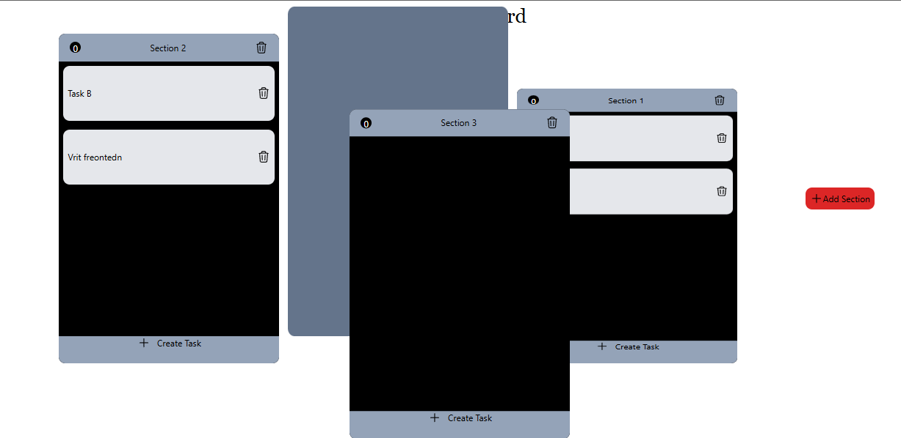
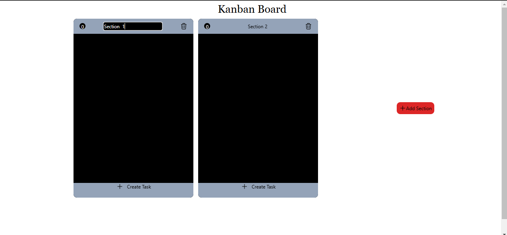
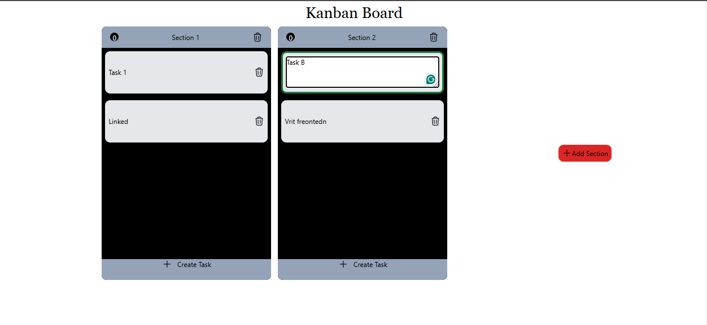
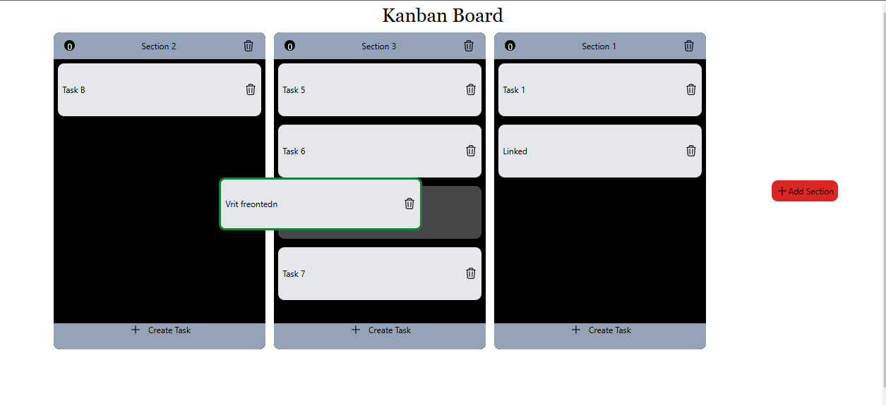

# Vrit Frontend 
## DND-Kanban-Board
### Submitted by: Manjil Maharjan

DND Kanban Board is a Drag And Drop -able Kanban Board and is made in React + Vite in Typescript (ts,tsx). The Kanban Board works perfectly and is very functional with drag and drop between section to sections and even tasks in same and tasks in other sections. Moreover, the Board is very editable with all the sections and tasks named and can be renamed and also, can be deleted individually one by one.
Everything is basic as UI but the functionality is very good and is coated with DND-kit

# Features
- Use of DND-kit and its styles and transitions.
- Editable and Deleteable
- Dynamic addition of Tasks and Sections as per required.

  ## Tech Stack
**Client:** React, TailwindCSS, Vite, Typescript npm packages, DND-kit

## Screenshots







## 🔗 Links
[](https://manjilmaharjan-portfolio.netlify.app/)
[](https://www.linkedin.com/in/manjil-maharjan/)


## Feedback

If you have any feedback, please reach out to me at :
manzilmaharjan00@gmail.com


## Run Locally

Clone the project

```bash
  git clone {repo sent}
```

Go to the project directory

```bash
  cd dndKanban
```

Install dependencies

```bash
  npm install
```

Start the server

```bash
  npm run dev
```

